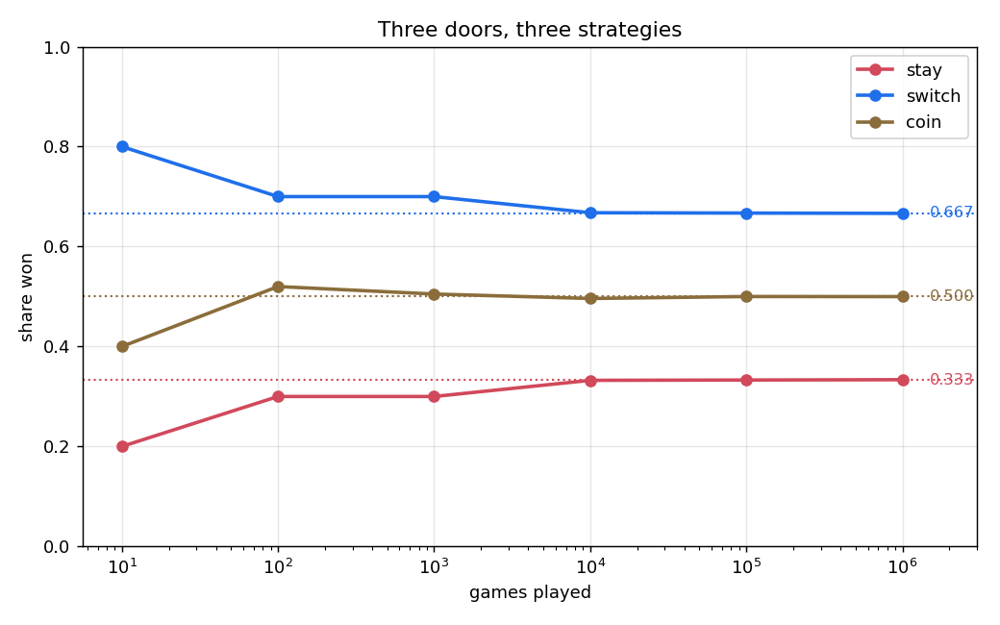
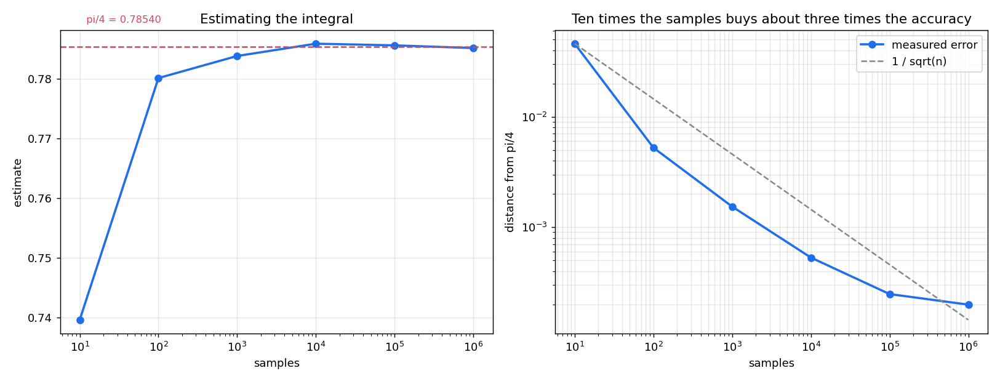
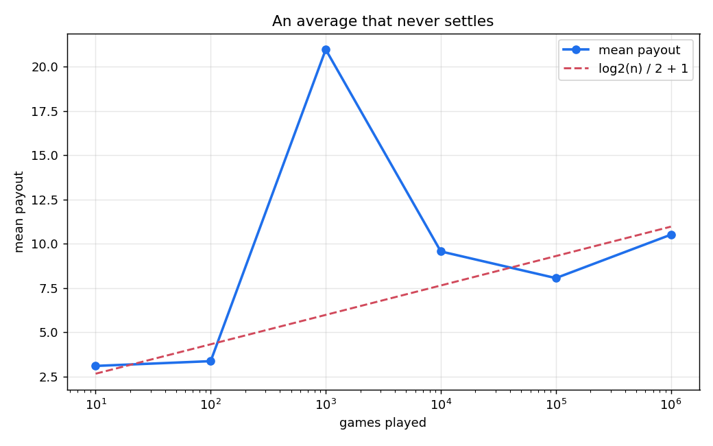
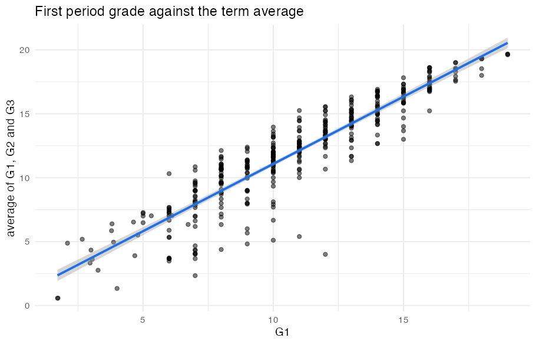
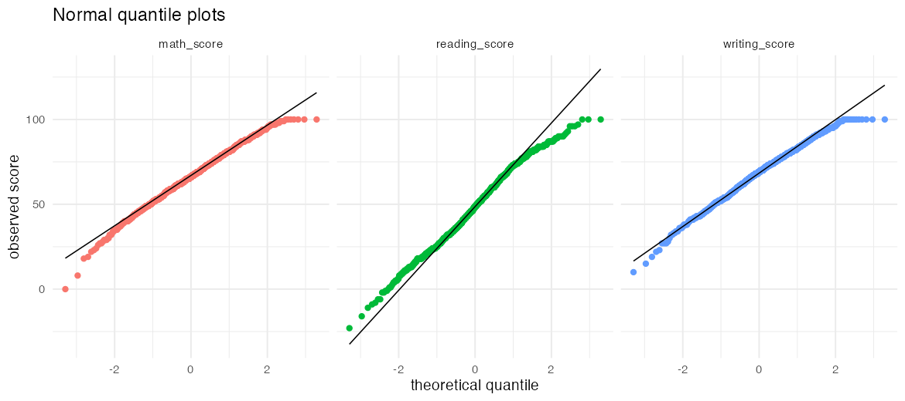

# Probability Simulations

Three questions with exact answers, simulated so the simulation can be checked
against the answer, and an analysis of two student datasets.

## Requirements

Python 3.10 or later for the simulations. R with ggplot2 for the analysis.

```bash
pip install -e ".[dev]"
make            # simulate, then analyse
make test
```

## Three doors



A contestant picks one of three doors, the host opens a losing one of the other
two, and the contestant may switch. Staying wins one time in three; switching
wins two times in three; flipping a coin between them wins half the time.

| strategy | won over 1,000,000 games | exact |
| --- | --- | --- |
| stay | 0.3336 | 1/3 |
| switch | 0.6664 | 2/3 |
| coin | 0.4998 | 1/2 |

The reason switching wins is easier to see from the first pick than from the
opened door: the first pick is right one time in three, and switching wins in
exactly the other two. `test_switching_wins_exactly_when_staying_loses` asserts
that, running both strategies on the same seed and requiring the two rates to
sum to one.

## An integral, by throwing darts



The integral of `sqrt(1 - x^2)` from 0 to 1 is `pi/4`. Estimating it by averaging
the integrand at uniform random points:

| samples | estimate | error | predicted error |
| --- | --- | --- | --- |
| 10 | 0.73960 | 0.04580 | 0.06963 |
| 1,000 | 0.78386 | 0.00154 | 0.00712 |
| 100,000 | 0.78565 | 0.00025 | 0.00070 |
| 1,000,000 | 0.78520 | 0.00020 | 0.00022 |

**The variance does not fall as the estimate improves**, and that is not a
mistake. The variance measures the spread of the integrand, which is a property
of the function; roughly 0.0499 whatever the sample count. What falls is the
spread of the *estimate*, which is that variance divided by the number of
samples. The last column is the square root of that, and the measured error
stays inside it.

The consequence is the flat right-hand slope: error falls with the square root
of the sample count, so a hundred times the work buys ten times the accuracy.
That is what makes Monte Carlo the wrong tool for a one-dimensional integral
and the right one when the dimension is high enough that grids stop fitting.

## A game worth infinity



A coin is tossed until it comes up tails; a run of k heads pays 2^k. Each
possible run contributes `(1/2)^k * 2^k = 1` to the expectation, and there are
infinitely many, so the expected payout does not converge.

What a simulation shows is that the average never settles. It drifts up roughly
like `log2(n) / 2 + 1`, so a quoted average is really a statement about how long
the run was:

| games | mean payout | largest single payout | log2(n)/2 + 1 |
| --- | --- | --- | --- |
| 100 | 3.37 | 32 | 4.32 |
| 10,000 | 9.57 | 32,768 | 7.64 |
| 1,000,000 | 10.51 | 524,288 | 10.97 |

The individual runs are not even monotone — a run of ten thousand games can
average more than a run of a million, because one rare enormous payout moves
the mean further than a million ordinary ones. The test suite asserts that
rather than smoothing it away.

Payouts are drawn from a geometric distribution rather than by tossing a coin
in a loop, which would spend most of its time on the runs that pay least.

## Two datasets

`analysis/performance.R` reads 395 school records and asks what predicts a
student's average across the three grading periods:

| predictor | correlation with the average |
| --- | --- |
| G1, the first period grade | 0.915 |
| previous failures | −0.548 |
| going out | −0.168 |
| study time | 0.158 |
| health | −0.084 |
| absences | −0.027 |

G1 correlating at 0.915 is not a finding — it is one of the three numbers being
averaged. Of the rest, past failures carry by far the most signal, and reported
study time carries about as much as going out.

The average is `(G1 + G2 + G3) / 3`. Dropped parentheses give `G1 + G2 + G3/3`,
a different quantity with a different correlation, and nothing about the output
would say which one was measured.



`analysis/exam_scores.R` reads 1,000 exam results:

| subject | mean | sd | Shapiro-Wilk p |
| --- | --- | --- | --- |
| maths | 66.09 | 15.16 | 0.00015 |
| reading | 48.45 | 21.69 | 0.00002 |
| writing | 68.05 | 15.20 | 0.00003 |

All three p-values reject normality. The quantile plots show why: the tails
bend away from the line rather than following it, so tests that assume normal
scores do not apply here without a transformation.



## Project structure

```
simulations/
    monty_hall.py      three strategies at three doors
    integration.py     the quarter circle, and how fast the error falls
    st_petersburg.py   an expectation that does not converge
    figures.py         the figures above
    cli.py             run all three
analysis/
    performance.R      school records: what predicts the term average
    exam_scores.R      exam scores: distributions and group differences
data/                  both datasets
tests/                 the simulations, checked against their exact answers
docs/                  figures
results/               measured numbers
```

## Testing

```bash
make test
```

Fifteen tests. Each simulation is checked against the closed form it is meant
to reproduce, rather than against a number recorded from an earlier run.
